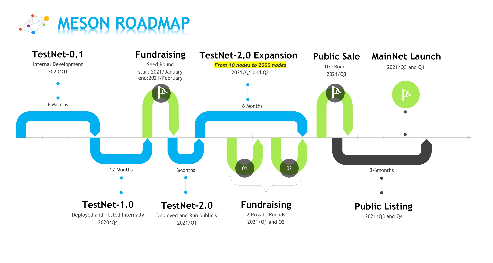

# FAQ

## Introduction

### What is Meson Network??

It is a bandwidth trading platform built on blockchain. We gather the idle bandwidth (and space) from the distributed servers worldwide, offering the servers’ suppliers the tokens as rewards, and helping speed up the streaming media.

### Who will have application requirements for Meson Network?

1. people who have servers with idle bandwidth (and space) that are much wasted.&#x20;
2. people who want to speed up their websites at a low price to users worldwide.&#x20;
3. people who want to obtain some files, pictures, or videos from the Internet, but it is too slow because of the regional transmission restrictions or somehow.

We don't recommend personal computers' users to install Meson yet. It is a rigmarole.

### **Why choose Meson Network?**

* Cheap - Make the best use of idle resources
* Fast     - We have many nodes around the world to help you accelerate
* Stable  - Files have multiple backups, and Meson could deliver your files well
* Win-Win for server owners and content owners

## Token .png>)

### **How many Meson Tokens are there in total?**

Please check [here](https://medium.com/meson-network/meson-token-metrics-economics-865461b92a52) for details.

* Initial Supply: 100,000,000 Meson
* Seed Token Sale: 6,000,000 Meson (6%)
* Private Token Sale: 22,000,000 Meson (22%)
* Public Token Sale: 10,000,000 Meson (10%)
* Community & Ecosystem: 20,000,000 Meson (20%)
* Foundation Reservation: 20,000,000 Meson (20%)
* Technical Team: 15,000,000 Meson (15%)
* Partners: 6,000,000 Meson (6%)
* Test-Net Mapping: 1,000,000 Meson (1%)

.png>)

## **Mining**

### **Why become a miner of Meson Network?**

1. To make full use of your idle resources of bandwidth (and space)
2. To earn the tokens for rewards
3. To help build a faster and balanced internet traffic market** **

### How to become a miner of Meson Network?

* Step1, Owning a server that could be a cloud platform virtual machine, or it could also be your own computers.
* Step2, Register at [https://meson.network/](https://meson.network) so you could log into the dashboard.
* Step3, follow the instructions to deploy your server to start the service of Meson Network.

They are pretty easy and fast steps, and more tutorials will be provided for your need\~

### Who are the most suitable miners for Meson Network?

1. Constant bandwidth users&#x20;
2. Dedicated servers owners&#x20;
3. IDC servers (corporation/organization/schools) owners.&#x20;

They are welcome to become our most stable terminals suppliers. As a result, by making the most use of these idle resources, it becomes an economical and healthy model according to the blueprint and positioning of the Meson Network Project.

### **What are the mining rules of Meson Network?**

Please check [https://meson.network/miningrules](https://meson.network/miningrules) for details.

**MiningScore = BandwidthScore \* StorageScore ( \* CreditScore).**

Basically, **Bandwidth **is the most important related fact for **BandwidthScore**.

And, **Storage Space **is necessary to cache the files for **StorageScore**. (There is no big difference between the same size HDD and SSD. The cheaper HDD is recommended.)

In addition, standing and stable servers will have a higher **CreditScore**.

Also, there will be some reward adjustments for servers in different regions.\

 (1).png>)

### **How long does it take for a round that Meson awards tokens?**

For security reasons, the rewarding period is randomly decided by some algorithms of Meson Network. If your mining server is not working properly during the rewarding period you may miss the reward tokens.

## Blockchain Contract

Ethereum Contract Address: 0x318b13467537f58890002847fe71eb2a74b6a5a5

Ethereum Contract: [Source Code](https://etherscan.io/address/0x318b13467537f58890002847fe71eb2a74b6a5a5#code)

### Where is the blockchain needed in the project?

1. With the help of blockchain mining, everyone can join our network rather than having a meeting with the salesperson or signing any contract.
2. Token mining rules will be programmed on the chain.
3. The future plans will be voted on the chain.
4. Token will be distributed on decentralized infrastructure, so everyone can literally own it and trade it.
5. We believe blockchain is such powerful that we can have the chance to build the world's biggest marketplace. It's crazy but it is just like any other unbridled achievement ^^

## **TestNet Period**

### **When will the testing period continue last?**

We wish to launch Meson on the MainNet at Q3-Q4 of 2021. If there is some big success, it can be earlier possibly.

### **What is the difference in the current testing period?**

All the Testnet Tokens will be mapped to 1% of the MainNet Tokens. According to [FAQ-Token](https://docs.meson.network/faq/token), there will be 100,000,000 initial Meson Tokens, of which there will be 1,000,000 Tokens are used as the exchange of TestNet Tokens.

**Your MainNet Tokens = (Your TestNet Tokens / All TestNet Tokens) \* (1% \* All MainNet Tokens)                           = (Your TestNet Tokens / All TestNet Tokens) \* 1,000,000**

> **For example, let's assume there will be total 160,000,000 TestNet Tokens at last, and you have 2,000,000 TestNet Tokens that time, then you will get (2,000,000 / 160,000,000) \* 1,000,000 = 125,000 MainNet Tokens.**

### **How many TestNet Tokens will be **distributed?

It is determined by the date when Meson will close the TestNet and launch into the MainNet. As a result, it is uncertain yet.

Currently, there are more and more miners and nodes joining. As huge amount nodes join in, Meson Project will start a community vote to decide the token distributed amount function(curve) of TestNet. So that while protecting the interests of existing miners to some extent, it could also increase the income of new entrants.

## About Test Tokens


Tutorial Video on How to exchange and stake Meson Test Tokens &#x20;


### **Why does Meson choose expensive Ethereum?**

Meson supports Ethereum as the first infrastructure layer to ensure the most significant ecosystem in crypto. ERC20 is the most adopted standard, it makes sure everything works fine and has the most compatible situation. Yes, the problem exists in the gas area, so supporting more infra like Arweave-smartweave, Solana, Polygon, ZK-Rollup is onboarding.

### **Do I have to exchange my test tokens? **

NO.

A very important reason why they are currently test tokens is to make sure everything goes smoothly step by step. You don't have to exchange your test tokens and this is not even recommended if you care much about the gas fee. However, if you would like to save your test tokens on some blockchain to keep them in another way, doing the exchange to Ethereum Network would be a nice option for you.

### What could I benefit from if I stake my test tokens?

Nothing yet.

On the Dashboard of [Meson.network](https://meson.network), there are "TokenBalance" and "Stake" pages. Doing the EXCHANGE at "TokenBalance" transfers your tokens from the database of Meson to the blockchain of Ethereum. And doing the STAKE at "Stake" transfers your tokens from the blockchain of Ethereum back to the database of Meson.

.png>)

As mentioned above, the default status of your test tokens is already STAKE. However, you can't get any earnings for the status of Stake yet. So please do not exchange your Meson Test Tokens if you wish to stake them, as it would just cost two times your Ethereum gas fee while back to square one.

### Can I trade(transfer) my test tokens after exchanging them to Ethereum?

Not yet.&#x20;

The functions of transfer for Meson Test Tokens on Ethereum are locked. After the double check of the contract safety, the transfer functions will open to the public.

For more details, please refer to [Ethereum Contract Source Code for Meson Test Tokens](https://etherscan.io/address/0x318b13467537f58890002847fe71eb2a74b6a5a5#code).
