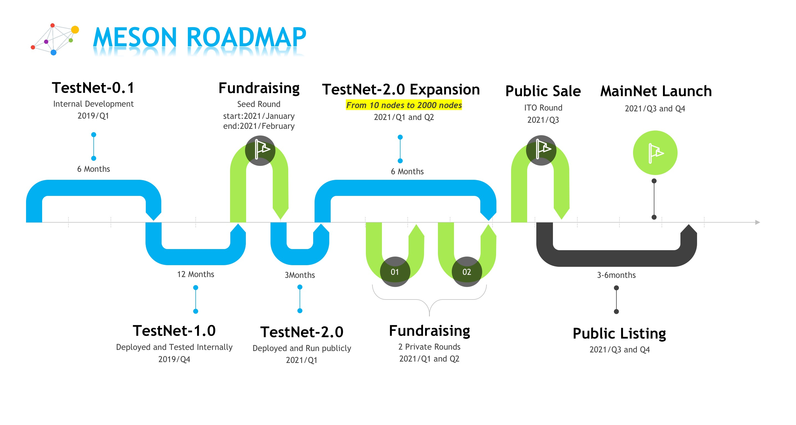

# TestNet Period

## **When will the testing period continue last?**

We wish to launch Meson on the MainNet at Q3-Q4 of 2021. If there is some big success, it can be earlier possibly.

## **What is the difference in the current testing period?**

All the Testnet Tokens will be mapped to 1% of the MainNet Tokens. According to [FAQ-Token](https://docs.meson.network/faq/token), there will be 100,000,000 initial Meson Tokens, of which there will be 1,000,000 Tokens are used as the exchange of TestNet Tokens.

**Your MainNet Tokens = \(Your TestNet Tokens / All TestNet Tokens\) \* \(1% \* All MainNet Tokens\)                           = \(Your TestNet Tokens / All TestNet Tokens\) \* 1,000,000**

> **For example, let's assume there will be total 160,000,000 TestNet Tokens at last, and you have 2,000,000 TestNet Tokens that time, then you will get \(2,000,000 / 160,000,000\) \* 1,000,000 = 125,000 MainNet Tokens.**

## **How many TestNet Tokens will be** distributed?

It is determined by the date when Meson will close the TestNet and launch into the MainNet. As a result, it is uncertain yet.

Currently, there are more and more miners and nodes joining. As huge amount nodes joining in, Meson Project will start a community vote to decide the token distributed amount function\(curve\) of TestNet. So that while protecting the interests of existing miners to some extent, it could also increase the income of new entrants.

